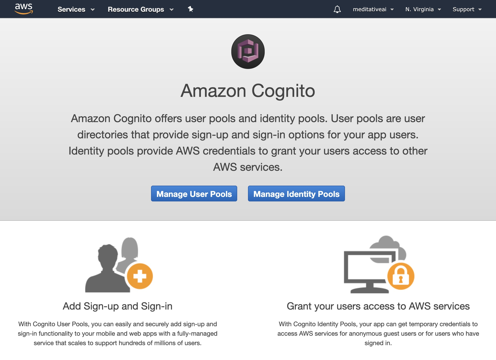
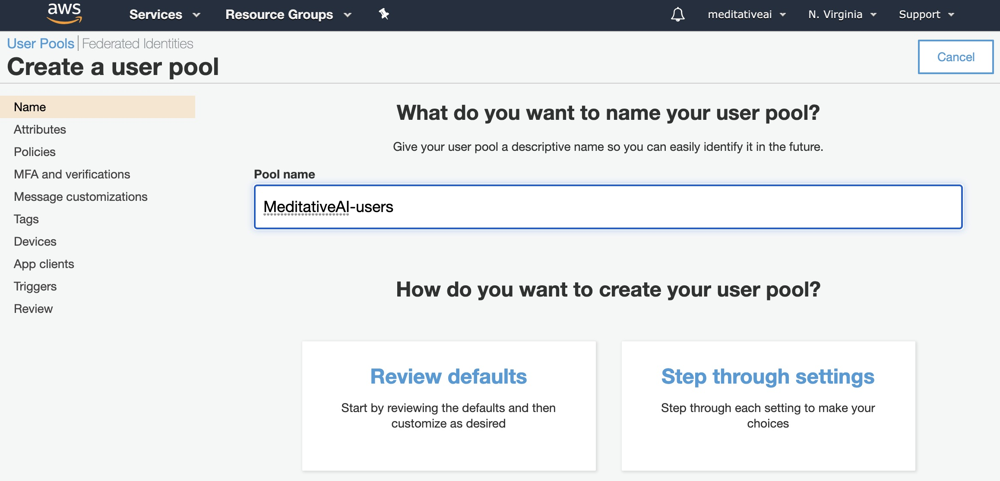
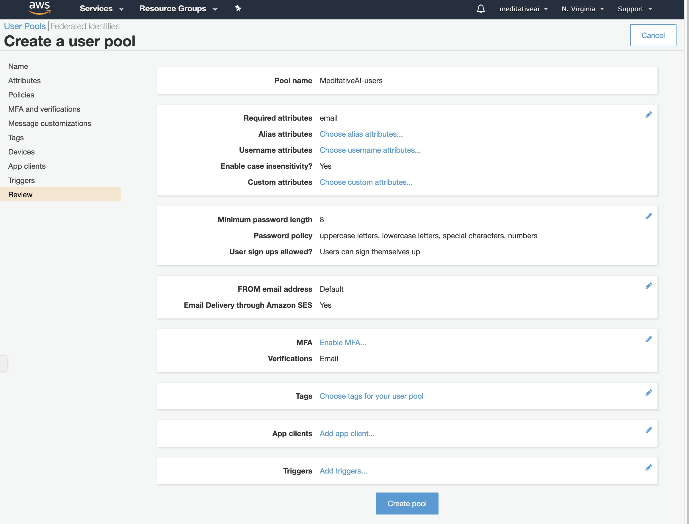
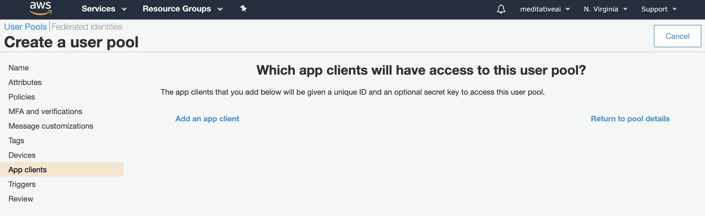
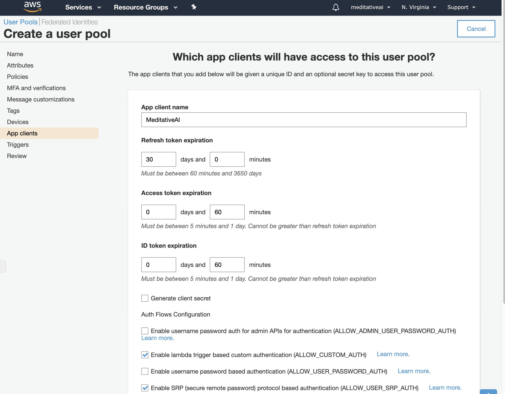
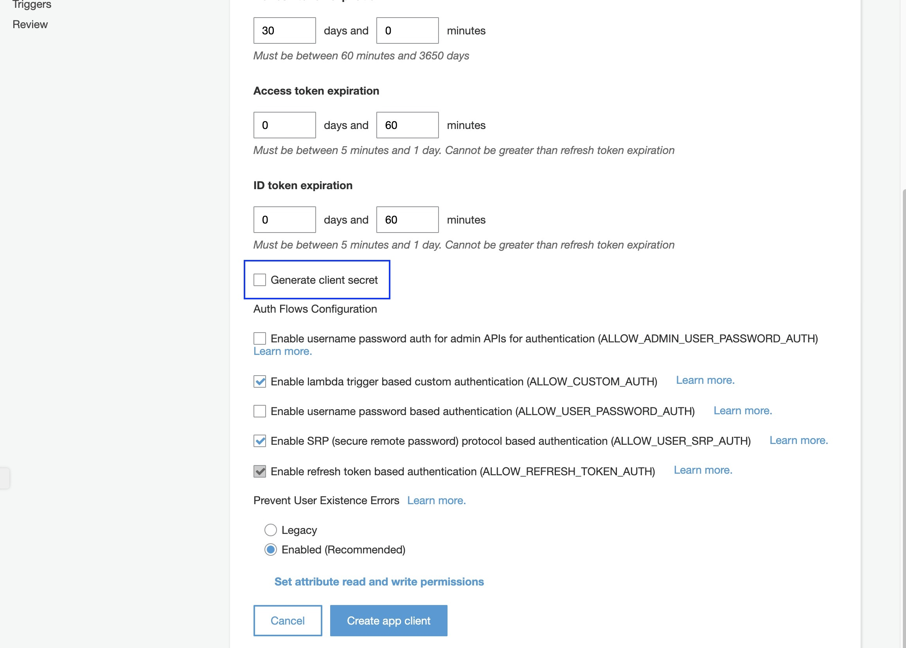
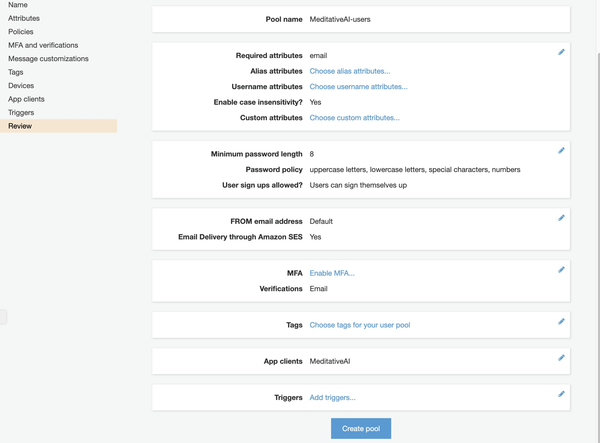
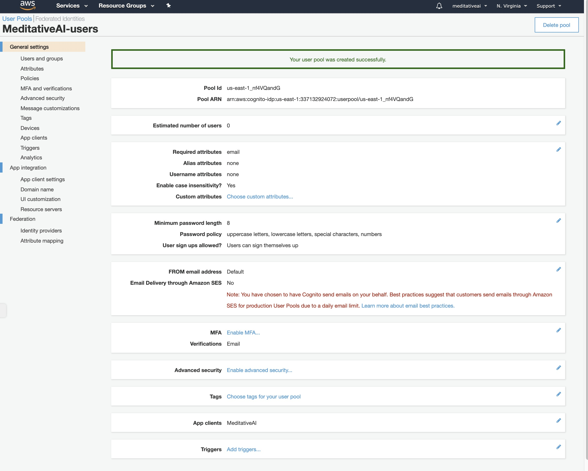
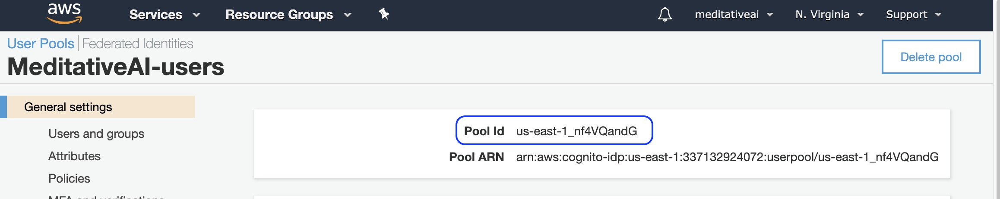
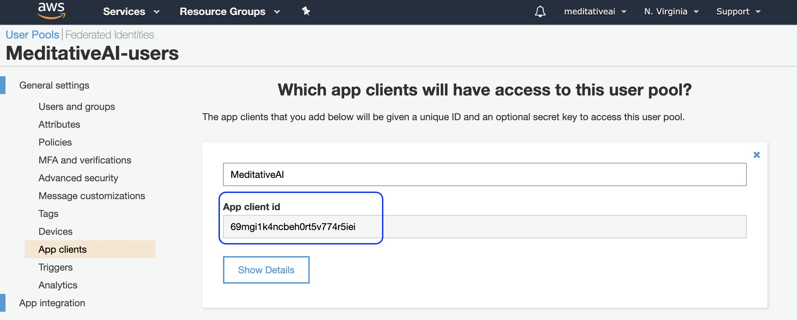

### AWS Cognito Setup

Setting up minimal default version of AWS Cognito User Pool using Management Console

Use the "Review defaults" option for quick setup

Select the "App clients" option and add an App client

Uncheck the "Generate client secret" button

Adjust any other user credentials settings as required and generate the user pool

Make a note of Pool and App client ids and for using in React

